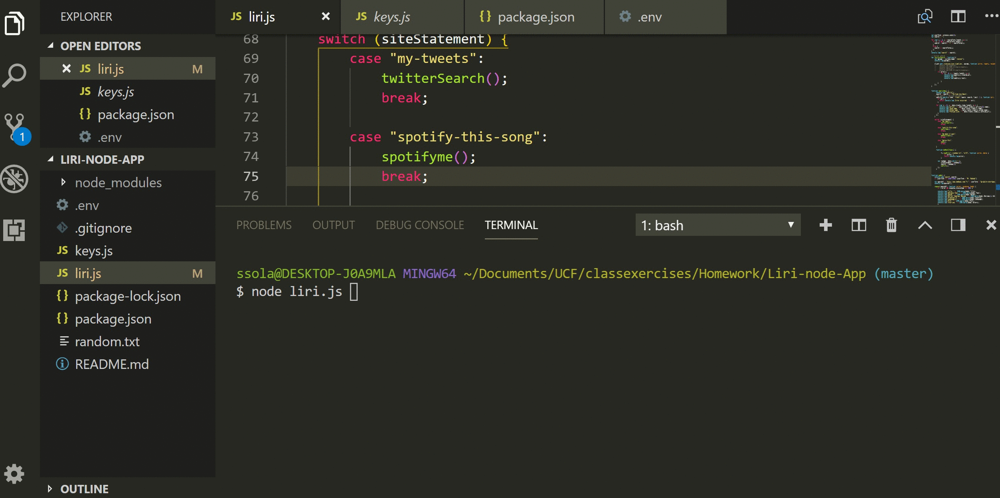
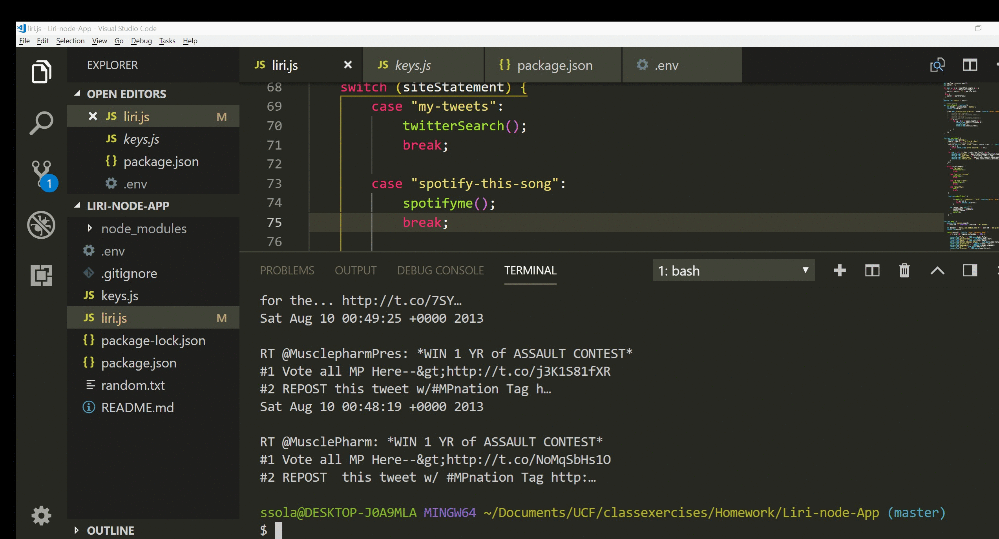
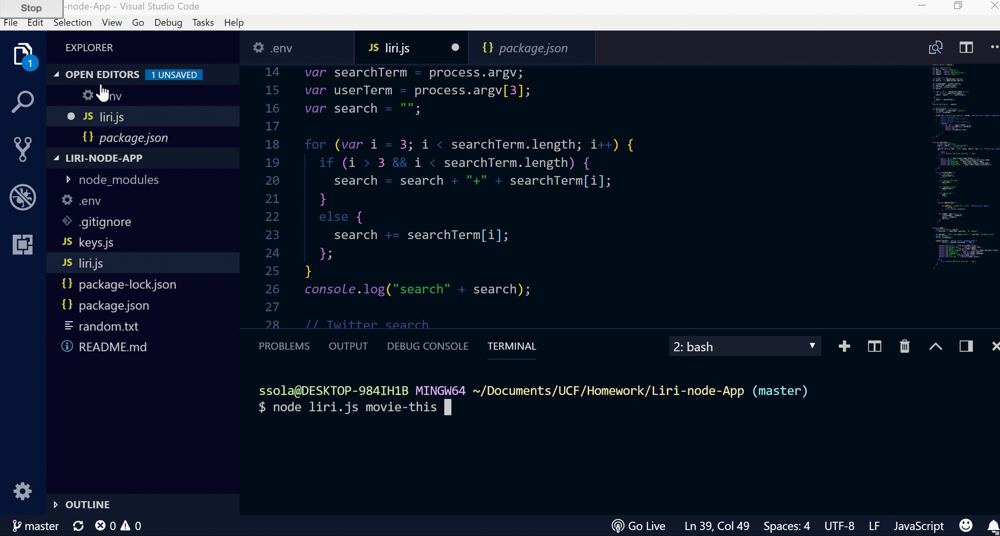

# Liri-node-App

### Overview
This homework assignment for the UCF Coding Boot Camp was called LIRI.  LIRI is a language Interpretation and Recognition Interface.  It will be command line node app that takes parameters and returns data.  In this assignment we are using Node.js to access the Twitter API, Spotify API, and the OMDB API using several NPM packages. Then using various search commands return a JSON response and console.log certain pieces of the response. We are also hiding keys using .env.

### GIFs

##Twitter
  

##Spotify
  

##OMDB
  

### Technologies Used
<ul>
<li>JavaScript</li>
<li>Node.js</li>
<li>NPM packages</li>
<li>process.env</li>
<li>Visual Studio Code</li>
</ul>

